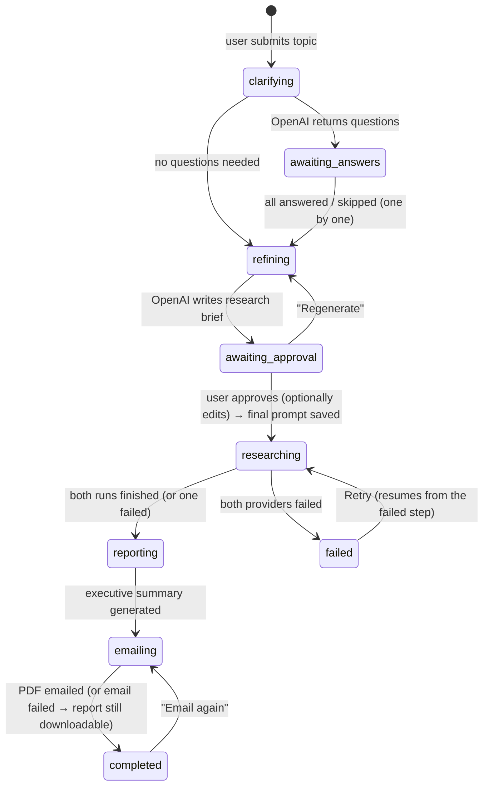
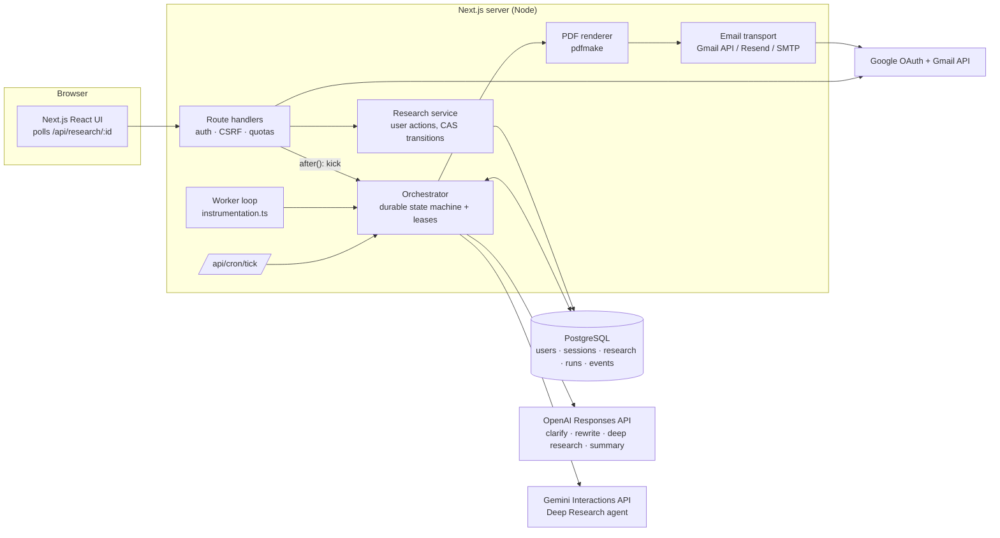

# Deep Research Assistant

A full-stack web app that runs **OpenAI Deep Research** and **Gemini Deep Research** on the same question and emails you a cited PDF report with both results.

- **Sign in with Google.** Your research history is tied to your Gmail account.
- **OpenAI refinement loop.** OpenAI asks clarifying questions, which the app shows **one at a time**. It then writes a detailed research brief that you can edit and approve.
- **Parallel deep research.** The approved brief is saved and sent unchanged to OpenAI Deep Research (Responses API, background mode) and the Gemini Deep Research agent (Interactions API, background mode).
- **Durable orchestration.** A database-backed state machine with leases, retries, backoff, timeouts, model fallbacks and partial-failure handling. Research keeps running if you close the tab or the server restarts.
- **PDF report by email.** The report has a cover page, metadata, an executive summary, the sections *OpenAI Deep Research Results* and *Gemini Results*, numbered citations and source lists, and an appendix. It's emailed from your own Gmail (Gmail API) with a summary in the body.
- **Mobile-first UI.** It shows the research form, live progress ("Awaiting OpenAI refinements", "Running OpenAI + Gemini deep research", …) and your research history with timestamps and status.

---

## Contents

1. [How it works](#how-it-works)
2. [Architecture](#architecture)
3. [Key design decisions](#key-design-decisions)
4. [Run it locally](#run-it-locally)
5. [API & credential setup](#api--credential-setup)
6. [Deploy](#deploy)
7. [Environment variables](#environment-variables)
8. [Testing](#testing)
9. [HTTP API](#http-api)
10. [Project structure](#project-structure)
11. [Known limitations](#known-limitations)

---

## How it works



1. **Submit.** The user types a research request. A `research_sessions` row is created with status `clarifying`.
2. **Clarify (OpenAI).** A fast OpenAI model, using structured JSON output, decides whether clarification would materially improve the research. If so, it returns up to 4 questions, each with quick-pick options and a rationale. The UI shows them one at a time, with Back, Skip, and "Skip remaining".
3. **Rewrite (OpenAI).** The request and answers are rewritten into a detailed, first-person research brief, following OpenAI's prompt-rewriting guidance for deep research.
4. **Approve.** The user reviews the brief, can edit or regenerate it, and approves it. The approved text is stored as `final_prompt`.
5. **Execute.** The orchestrator creates one `provider_runs` row per provider and starts both jobs in **background mode**:
   - OpenAI: `responses.create({ model: "o3-deep-research", background: true, tools: [web_search_preview], … })`
   - Gemini: `interactions.create({ agent: "deep-research-preview-04-2026", background: true, … })`
6. **Monitor.** Both jobs are polled on a schedule, with live progress such as "Researching — 14 web searches so far". When a job finishes, its report, normalized citations, token usage and duration are stored.
7. **Report.** An executive summary (headline, key insights, OpenAI-vs-Gemini comparison, top sources) is generated, and the PDF is rendered with pdfmake.
8. **Deliver.** The PDF is emailed to the signed-in Gmail address. The email body contains the summary, top sources, run stats and a link back to the app.

## Architecture



| Layer | Location | Responsibility |
|---|---|---|
| UI | `src/app`, `src/components` | Server components load initial data; client components poll and drive actions |
| HTTP | `src/app/api/**`, `src/server/http.ts` | Auth, same-origin/JSON checks, validation errors → JSON, ownership |
| Application service | `src/server/research/service.ts` | User actions (create, answer, approve, cancel, retry, resend) as compare-and-set status transitions |
| Orchestrator | `src/server/research/orchestrator.ts` | Advances automated states. Idempotent, re-entrant steps. Lease per research row |
| Providers | `src/server/providers/*` | `DeepResearchProvider` interface (`start` / `poll` / `cancel`) with OpenAI, Gemini and mock implementations |
| Refinement & summary | `src/server/research/refinement.ts`, `src/server/report/summary.ts` | OpenAI structured-output calls, plus deterministic fallbacks |
| Report | `src/server/report/*` | Markdown → pdfmake converter, document layout, glyph sanitizing |
| Email | `src/server/email/*` | MIME building, Gmail API / Resend / SMTP / console transports, HTML template |
| Data | `src/server/db/*`, `drizzle/` | Drizzle schema and SQL migrations, applied automatically on boot |
| Composition root | `src/server/services.ts` | Selects real or simulated implementations; tests inject fakes |

## Key design decisions

**Refinement uses OpenAI's recommended pattern.** The Deep Research API models don't ask clarifying questions; they expect a fully formed brief. OpenAI's guidance is to reproduce ChatGPT's flow (clarify → rewrite prompt → deep research) with a fast model, and that's what this app does. Questions come back as strict JSON (`text.format: json_schema`), so the UI can show them one at a time with quick-pick answers. The rewrite step turns everything into first-person researcher instructions that ask for tables, inline citations, primary sources and recency notes. The user approves the brief, and Gemini receives exactly the same text with no refinement of its own.

**Background mode and polling for both providers.** Deep research takes 5–30+ minutes, longer than any HTTP request or serverless timeout. Both providers are started with `background: true`, and only the remote job ID is stored. Provider adapters are stateless, so any process can poll a job that another process started. Jobs survive deploys and restarts.

**A durable state machine with leases, not in-memory promises.** Every automated step (`clarifying`, `refining`, `researching`, `reporting`, `emailing`) is advanced by `advanceResearch(id)`. It first takes a short **lease** on the row with an atomic `UPDATE … WHERE lease_until < now() RETURNING`. Three triggers can call it concurrently and safely:

1. the in-process worker loop (`WORKER_MODE=inline`, started from `instrumentation.ts`)
2. `POST /api/cron/tick`, for serverless hosts or as a keep-alive
3. an immediate "kick" via `after()` after a user action, or when a polled status is overdue (self-healing)

The test suite checks that concurrent advances never double-start a provider.

**Retries and failure handling.**
- Errors are classified as *transient* (429, 5xx, network), *permanent* (validation, auth) or *model unavailable*.
- Transient errors are retried with exponential backoff and full jitter. There are per-run error budgets (8 consecutive start/poll errors) and per-step budgets (5).
- If a provider-side job fails (`status: failed`), it's restarted once with a fresh remote job.
- If a configured model or agent is rejected as unavailable, the next one in a fallback chain is tried, and the UI activity log says which one ran. This covers OpenAI deep research models (e.g. `o3-deep-research` → `gpt-5.5` with web search and high reasoning effort), Gemini agent versions, and the fast refinement models.
- Each provider has a timeout (default 75 min) that cancels the remote job.
- If one provider fails, the report is still built from the other. The failure is flagged on the cover page, in the provider's section and in the email. Only when both fail is the research marked `failed`, and **Retry** resumes from the earliest incomplete step without re-running a provider that already succeeded.
- If email delivery fails, the research is still marked `completed` with `email_status=failed`. The PDF stays downloadable and can be re-sent.

**Citations are normalized.** OpenAI returns `url_citation` annotations over inline `([site](url))` links, indexed in UTF-16. Gemini returns `url_citation` annotations with **UTF-8 byte offsets**. Both are converted into numbered `[n]` markers (superscript links in the PDF) and a deduplicated, tracking-parameter-free source list per provider (`src/server/providers/citations.ts`).

**PDF in pure JavaScript (pdfmake), no headless browser.** This works on any Node host and in a ~200 MB container. The Markdown → pdfmake converter handles headings, nested lists, task lists, tables (column widths computed from content), blockquotes, code, links and citations. It swaps emoji the font can't draw (✅ → "Yes") and keeps headings with the content that follows them. The renderer blocks all remote and local resource access, because report content comes from model output.

**Email comes from the user's own Gmail.** Sign-in requests the `gmail.send` scope with offline access. Better Auth stores the refresh token **encrypted at rest** (`encryptOAuthTokens`), and the background worker uses it to send the report from the user to themselves via the Gmail API media-upload endpoint (up to 35 MB). `EMAIL_PROVIDER=resend|smtp` switches to a system sender instead.

**Security.**
- Better Auth sessions use HTTP-only cookies.
- Every query is scoped to the session user.
- State-changing endpoints require a same-origin `application/json` request (CSRF defence).
- Per-user quotas cap spend: 3 concurrent and 20 per day.
- Model output is rendered as Markdown with raw HTML escaped and only `http(s)`/`mailto` links allowed.
- The cron endpoint uses a constant-time bearer check.
- Security headers are set, and all secrets stay server-side.

**Scaling.** Web and worker can run as separate processes (`WORKER_MODE=external` plus `npm run worker`) and scale horizontally, because leases make every step single-writer. Polling could be replaced by provider webhooks without changing the state machine.

## Run it locally

Requirements: Node 20.9+ (22 recommended). Postgres is optional.

```bash
npm install
cp .env.example .env.local
```

**Mock mode (no API keys, no Postgres).** Set these in `.env.local`:

```bash
DATABASE_URL=pglite://./.data/pglite   # embedded Postgres (WASM)
RESEARCH_MOCK_PROVIDERS=true           # simulated refinement + research (clearly labelled)
EMAIL_PROVIDER=console                 # writes .eml + PDF to .data/outbox/
GOOGLE_CLIENT_ID=...                   # sign-in still uses Google; see setup below
GOOGLE_CLIENT_SECRET=...
```

```bash
npm run dev          # http://localhost:3000
```

**Real mode.** Set `OPENAI_API_KEY`, `GEMINI_API_KEY`, `EMAIL_PROVIDER=gmail` and a Postgres `DATABASE_URL`. Migrations run automatically on boot, or manually with `npm run db:migrate`.

Other scripts:

| Command | What it does |
|---|---|
| `npm test` | Vitest suite (orchestrator end to end on embedded Postgres, providers, citations, PDF, email) |
| `npm run lint` / `npm run typecheck` | ESLint / TypeScript |
| `npm run sample-report` | Renders `.data/sample-report.pdf` from synthetic provider payloads, for checking the layout |
| `npm run worker` | Standalone orchestrator worker (`WORKER_MODE=external` on the web service) |
| `npx tsx --conditions=react-server scripts/dev-session.ts you@gmail.com` | **Local testing only:** prints a session cookie, so the app can be driven without Google OAuth |

## API & credential setup

### Google OAuth (sign-in + Gmail send)

Step-by-step instructions are in [docs/GOOGLE_SETUP.md](docs/GOOGLE_SETUP.md). In short:

1. In Google Cloud Console, create a project and **enable the Gmail API**.
2. Configure the **OAuth consent screen** (External). Add the scopes `openid`, `email`, `profile` and `https://www.googleapis.com/auth/gmail.send`. While the app is in *Testing*, add yourself and any reviewers as **test users**.
3. Create an **OAuth client ID** (Web application) with the redirect URI `https://<your-app>/api/auth/callback/google` (and `http://localhost:3000/api/auth/callback/google` for local runs).
4. Set `GOOGLE_CLIENT_ID` and `GOOGLE_CLIENT_SECRET`.

> `gmail.send` is a *sensitive* scope. Unverified apps show a "Google hasn't verified this app" screen to test users. That's expected; choose **Continue**. If you'd rather not request it, use `EMAIL_PROVIDER=resend` or `smtp`.

### OpenAI

- Create an API key at platform.openai.com. Deep research models may require a verified organization.
- `OPENAI_DEEP_RESEARCH_MODEL` defaults to `o3-deep-research`. If your key can't use it (OpenAI has announced retirements of the original deep-research snapshots), the app automatically uses `OPENAI_DEEP_RESEARCH_FALLBACK_MODELS` (default `gpt-5.5`, run with the `web_search` tool and high reasoning effort in background mode) and records the fallback in the activity log.
- Refinement and summary use `OPENAI_REFINEMENT_MODEL` / `OPENAI_SUMMARY_MODEL` (default `gpt-5.4-mini`), with automatic fallback to `gpt-5-mini` and then `gpt-4.1-mini`.

### Gemini

- Create a key in Google AI Studio. The Deep Research agent may require billing to be enabled on the key's Google Cloud project.
- `GEMINI_DEEP_RESEARCH_AGENT` defaults to `deep-research-preview-04-2026`, falling back to `deep-research-pro-preview-12-2025`.

## Deploy

The app needs a **long-running Node process** (for the in-process worker) and **Postgres**.

### Render (recommended, one click)

1. Push this repo to GitHub. In Render, choose **New → Blueprint** and select the repo. [`render.yaml`](render.yaml) creates the Docker web service and a Postgres database, and generates `BETTER_AUTH_SECRET` and `CRON_SECRET`.
2. Fill in `BETTER_AUTH_URL` (e.g. `https://deep-research-assistant.onrender.com`), the Google OAuth client, `OPENAI_API_KEY` and `GEMINI_API_KEY`.
3. Add `https://<your-app>/api/auth/callback/google` to the OAuth client's redirect URIs.

The blueprint uses the `starter` plan because free web services sleep after 15 idle minutes, which pauses research that is in progress. To stay on the free plan, enable the keep-alive workflow: set repository secrets `APP_URL` and `CRON_SECRET`, and the variable `ENABLE_CRON_TICK=true`. [`.github/workflows/cron-tick.yml`](.github/workflows/cron-tick.yml) then calls `/api/cron/tick` every 5 minutes.

### Railway / Fly.io / any Docker host

Use the [`Dockerfile`](Dockerfile), a multi-stage Next.js standalone image (non-root, with health check). Provide `DATABASE_URL` and the variables below. Migrations run on boot.

### Vercel (serverless)

This works with caveats. Set `WORKER_MODE=off` and drive the orchestrator with an external scheduler hitting `/api/cron/tick` (Vercel Hobby cron is limited to once a day, so use the GitHub Action above). The open research page also advances its own session while you watch it.

## Environment variables

See [`.env.example`](.env.example) for the full annotated list.

| Variable | Required | Default | Purpose |
|---|---|---|---|
| `DATABASE_URL` | yes | `pglite://./.data/pglite` | Postgres URL, or `pglite://…` for the embedded DB |
| `BETTER_AUTH_URL` | yes | `http://localhost:3000` | Public app URL (OAuth callbacks, email links) |
| `BETTER_AUTH_SECRET` | yes (prod) | — | Session signing and token encryption key |
| `GOOGLE_CLIENT_ID` / `GOOGLE_CLIENT_SECRET` | yes | — | Google OAuth client |
| `OPENAI_API_KEY` | yes* | — | OpenAI (refinement, deep research, summary) |
| `GEMINI_API_KEY` | yes* | — | Gemini Deep Research agent |
| `OPENAI_DEEP_RESEARCH_MODEL` | | `o3-deep-research` | First-choice deep research model |
| `OPENAI_DEEP_RESEARCH_FALLBACK_MODELS` | | `gpt-5.5` | Comma-separated fallbacks |
| `OPENAI_REFINEMENT_MODEL` / `OPENAI_SUMMARY_MODEL` | | `gpt-5.4-mini` | Fast models |
| `OPENAI_MAX_TOOL_CALLS` | | — | Optional cap on searches per run |
| `GEMINI_DEEP_RESEARCH_AGENT` | | `deep-research-preview-04-2026` | Gemini agent |
| `GEMINI_DEEP_RESEARCH_FALLBACK_AGENTS` | | `deep-research-pro-preview-12-2025` | Comma-separated fallbacks |
| `EMAIL_PROVIDER` | | `gmail` | `gmail`, `resend`, `smtp` or `console` |
| `EMAIL_FROM`, `RESEND_API_KEY`, `SMTP_URL` | for resend/smtp | — | System sender settings |
| `WORKER_MODE` | | `inline` | `inline`, `external` or `off` |
| `CRON_SECRET` | for cron | — | Bearer token for `/api/cron/tick` |
| `PROVIDER_POLL_INTERVAL_MS` | | `15000` | Provider polling cadence |
| `PROVIDER_TIMEOUT_MINUTES` | | `75` | Per-provider timeout |
| `RESEARCH_MOCK_PROVIDERS` | | `false` | Simulated providers for demos and tests |

\* Not needed when `RESEARCH_MOCK_PROVIDERS=true`.

## Testing

```bash
npm test
```

There are 42 tests across 5 files:

- **`tests/orchestrator.test.ts`.** The full lifecycle on an in-memory Postgres (PGlite), with real SQL migrations: refinement answered and skipped one by one, edited approval, both providers, summary, PDF and email. It also covers:
  - one provider failing (report still delivered)
  - both failing, then Retry
  - transient start errors with backoff
  - restarting a failed remote job
  - email failure, then resend
  - lease contention (no double starts)
  - ownership and state-conflict checks
  - cancellation
  - degraded vs. fatal refinement errors
- **`tests/providers.test.ts`.** OpenAI and Gemini adapters against mocked SDK clients: request shape (background mode, tools, agent config), model/agent fallback, status mapping and error classification.
- **`tests/citations.test.ts`.** Citation normalization for both providers' index units (UTF-16 vs UTF-8 bytes), deduplication, tracking-parameter stripping and parsing of realistic payloads.
- **`tests/report.test.ts`.** Markdown → PDF conversion, required section titles, a valid PDF buffer, the email template (HTML escaping) and the MIME attachment.
- **`tests/errors.test.ts`.** Error classification, backoff bounds and retry behaviour.

CI ([`.github/workflows/ci.yml`](.github/workflows/ci.yml)) runs lint, typecheck, tests and a production build.

## HTTP API

All endpoints require a session cookie. Mutations must be same-origin `application/json`.

| Method & path | Description |
|---|---|
| `GET /api/research` | Research history for the signed-in user |
| `POST /api/research` `{query}` | Start a research session (→ `clarifying`) |
| `GET /api/research/:id` | Detail: status, questions, brief, runs, summary, events |
| `POST /api/research/:id/answers` | `{action:"answer",questionId,answer}` · `{action:"skip",questionId}` · `{action:"skip_remaining"}` · `{action:"reopen",questionId}` |
| `POST /api/research/:id/approve` `{prompt?}` | Approve (optionally edited) brief → start both providers |
| `POST /api/research/:id/regenerate` | Ask OpenAI for a fresh brief |
| `POST /api/research/:id/cancel` · `/retry` · `/resend-email` | Lifecycle actions |
| `GET /api/research/:id/report[?download=1]` | PDF report (regenerated on demand) |
| `DELETE /api/research/:id` | Delete a finished research session |
| `POST /api/cron/tick` | Advance due sessions (`Authorization: Bearer $CRON_SECRET`) |
| `GET /api/health` | Liveness and DB check |

## Project structure

```
src/
  app/                      Next.js App Router pages + route handlers
    api/research/…          research API
    api/auth/[...all]       Better Auth (Google OAuth)
    api/cron/tick           external scheduler entry point
  components/               UI (dashboard, refinement wizard, approval, progress, results)
  lib/                      shared types, client API, safe Markdown, formatting
  server/
    auth/                   Better Auth config, session helper, Google token refresh
    db/                     Drizzle schema + client (Postgres or PGlite)
    providers/              OpenAI + Gemini deep research adapters, mock, citations
    research/               service (user actions), orchestrator, repository, prompts, worker
    report/                 PDF renderer (pdfmake), summary, glyph handling
    email/                  transports (Gmail API, Resend, SMTP, console) + template
    services.ts             composition root
  instrumentation.ts        boot: migrations + worker
drizzle/                    SQL migrations
scripts/                    migrate, worker, sample-report, dev-session
tests/                      Vitest suites + fixtures
docs/                       Google setup guide, video walkthrough outline
```

## Known limitations

- **No live API validation in this build.** The provider integrations follow the official `openai` (v7) and `@google/genai` (v2) SDK type definitions. They are covered by mocked-client tests and a full end-to-end run with simulated providers, but they could not be exercised against the live APIs from the build environment. Run one real research session after configuring keys. Model and agent names are configurable, and fallback chains handle retired models.
- **Polling, not webhooks.** Polling keeps deployment simple; both providers also offer webhooks, which would cut latency and API calls.
- **No streaming of intermediate reasoning.** The UI shows coarse progress (search counts, elapsed time), not the providers' streamed thought summaries.
- **Report quality depends on the providers.** The app's job is to ask good clarifying questions, write a strong brief (tables, citations, primary sources, verification notes) and present both results faithfully.
